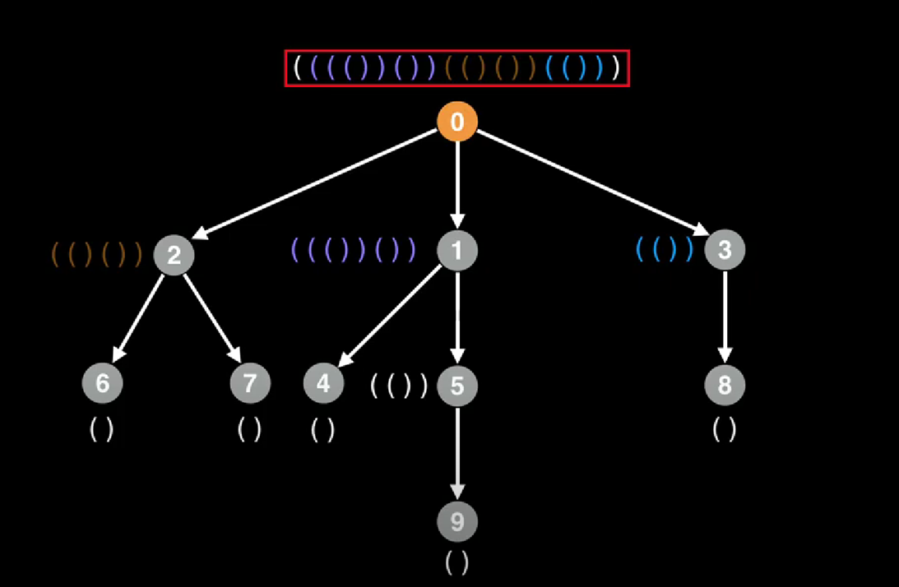
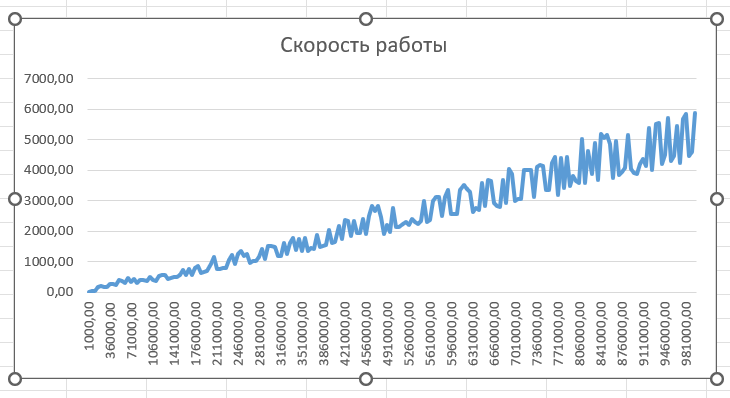

# Изоморфизм деревьев
###### Баздуков В.А.


# Введение
В данной работе будет рассматриваться проблема изоморфизма деревьев. Основные идеи были взяты из книги Ахо А., Хопкрофта Дж., Ульмана Дж. "Построение и анализ вычислительных алгоритмов".

На практике алгоритм хорошо зарекомендовал себе в молекулярной химии, где зачастую изучаемые структуры представляют собой деревья с миллионами вершин. Таким образом задача проверки изоморфности двух структур сводится к проверке изоморфности двух деревьев.

# Теория
## Изоморфизм графов
Так как корневое дерево является частным случаем графа, то сначала стоит дать определение изоморфизма графов.

**Определение.** ***Изоморфизмом графов*** $G_{1}(V_{1},E_{1})$ и $G_{2}(V_{2},E_{2})$ называется биекция между наборами вершин $\varphi$: $V_{1} \rightarrow V_{2}$ такая что: 
$$\forall u,v \in V_{1} \quad (u,v) \in E_{1} \Leftrightarrow (\varphi(u), \varphi(v)) \in E_{2}$$ 
Выделяют несколько фактов об изоморфизме графов:
* До сих пор неизвестно, является ли алгоритм изоморфизма графов NP -- полной задачей.
* Существует алгоритм с полиноминальным временем для различных подмножеств графов, таких как деревья

(Источник - https://logic.pdmi.ras.ru/~smal/files/smal_jass08_slides.pdf)
## Корневые деревья

**Определение.** ***Корневое дерево*** **(V,E,***r***)** это дерево (V,E), в котором определен корень r $\in$ V.

**Определение.** ***Изоморфизмом корневых деревьев*** $T_{1}(V_{1},E_{1},r_{1})$ и $T_{2}(V_{2},E_{2},r_{2})$ называется биекция между наборами вершин $\varphi: V_{1} \leftarrow V_{2}$ такая что:
$$\forall(u,v)\in V_{1} \quad (u,v)\in E_{1} \Leftrightarrow (\varphi(u),\varphi(v)) \in E_{2}\quad \fbox{$\varphi(r_{1} = r_{2})$} $$

Так как корневые деревья дают нам гораздо больше информации о самих себя, нежели графы, то существует алгоритм, работающий за полиноминальное время.

(Источник - https://en.wikipedia.org/wiki/Graph_isomorphism_problem)
# Постановка задачи
Требуется разработать алгоритм проверки изоморфности двух деревьев за ассимтотику ```O(n*log(n))```. Провести тестирование с использованием ручных тестов
и тестов с использованием генератора.
# Алгоритм AHU

Данный алгоритм был разработан Ахо А. Хопкрофтом Дж., Ульман Дж. для определения изоморфности двух деревьев. 
	
У этого алгоритма есть 2 основных свойства:
* Определяет изоморфизм корневого дерева за O(n*log(n))
* Использует полную историю потомков степеней вершин в своей работе

**Основная идея алгоритма** состоит в том, чтобы связывать с каждой вершиной кортеж, который хранит полную историю его потомков, иначе говоря, ***сериализовать*** дерево. В свою очередь это обеспечивает детерминированный метод проверки изоморфизма дерева.



## Описание работы
Изоморфизм деревьев может быть найден следующим алгоритмом:
* Определить ***центр(-ы)*** деревьев
* Преобразовать оба дерева в ***корневые деревья***, где корень - центр дерева
* ***Сериализовать*** оба дерева. Если деревья изоморфны - результат сериализации будет идентичным.

### Диаметр и центр дерева

**Определение.** ***Диаметр дерева*** это длина самого длинного пути между его листьями.

**Определение.** Центром называется такая вершина $v$, что самый длинный путь от $v$ до листа минимален (половина диаметра).

Есть несколько способов найти центр дерева. В этой работе будет описан подход, который заключается в том чтобы итеративно отбирать каждый листовой узел, подобно "чистке лука"

**Определение.** ***Степень узла*** - это количество узлов, с которыми он связан.

Степень листовых узлов равна одному (по определению). 

После того, как алгоритм найдет все такие узлы, он удалит их из поиска, тем самым уменьшив степень всех смежных с листьями узлов на один. Далее алгоритм будет итеративно удалять новые листья до тех пор, пока не останется одна или две вершины. Эти самые вершины и будут центром(-ами) дерева.

```function treeCenters(g):
    n = g.numberOfNodes()
    degree = [0] * n
    leaves = []
    for(i=0; i<n; i++):
        if degree[i] == 0 or degree[i] == 1:
            leaves.add(i)
            degree[i] = 0
    count = leaves.size()
    
    while count < n:
        new_leaves = []
        for node in leaves:
            for neighbor in g[node]:
                degree[neighbor] = degree[neighbor] - 1
                if degree[neighbor] == 1:
                    new_leaves.add(neighbor)
        count += new_leaves.size()
        leaves = new_leaves
```
Параметр $g$ функции **treeCenters()** представляет собой неориентированный граф.

 Переменная $n$ представляет количество узлов в нашем дереве. Мы определили два массива, степень и листья. Первый имеет размер $n$ и хранит степень каждого узла в дереве, последний хранит самый последний слой конечных узлов. 
 
 Затем мы входим в цикл, где мы вычисляем степень каждого узла графа, также мы проверяем, рассматривается ли дерево с одним узлом или же листовой узел. Если какое-либо из этих условий выполняется, мы добавляем запись в массив листьев и помечаем ее значение в ***degrees array*** как 0, чтобы не посещать узел вновь. 
 
 Переменная $count$ будет отслеживать количество узлов, которые мы обработали на текущей итерации. Затем мы постоянно проверяем наличие листьев и удаляем их из поиска. 

## Сериализация дерева

Сериализованное представление дерево будет получено путем перевода его в уникальную кодировку, которая представляет собой последовательность открывающих и закрываюх скобок, например "(()()()(()))".  

Формальное описание работы:
* Присвоить всем листьям метку "()"
* Для каждого родителя объединить метки его детей и заключить в новую пару скобок.


Рассмотрим псевдокод:
```
function encode(node):
    if node == null:
        return ""
    labels = []
    for child in node.children():
        labels.add(encode(child))
    
    # lexographic sort
    sort(labels)

    result = ""
    for label in labels:
        result += label
    
    return "(" + result + ")"
```
Из основной программы в функцию передается центр дерева. Способ кодирования дерева с 2-мя центрами будет рассмотрен в след. главе.

Таким образом, если результат кодировки двух деревьев одинаков - деревья изоморфны.

## Проверка на изоморфизм при наличии двух центров

Отличие в кодировании дерева с 2-мя центрами заключается в том, что обозреваемое дерево разбивается на 2 поддерева, корнями которых являются оба центра. Все, что остается сделать в этом случае, это сравнить результат работы алгоритма для каждого из поддеревьев первого дерева со вторым. 

Псевдокод выглядит следующим образом:
```
function is_isomorphic(tree a, tree b):
    a_centers = find_centers(a)
    b_centers = find_centers(b)

    a_encoded = [encode(a, a_centers[0]), encode(a, a_centers[0])]
    b_encoded = [encode(b, b_centers[0]), encode(b, b_centers[0])]
    
    sort(a_encoded)
    sort(b_encoded)

    return a_encoded.ToString == b_encoded.ToString
```

Как видно из примера, алгоритм последовательно кодирует каждый центр каждого дерева, затем лексикографически сортирует результаты. Одинаковые кодировки соответствуют изоморфным деревьям.

# Реализация на С++
Исходный код можно найти [здесь](https://github.com/cingetable/isomophic-trees-lab/blob/main/src/isomorphic.cpp).
Структура проекта подразумевает деление на следующие модули:
* исходный код алгоритма
* система с ручными тестами
* генератор
* тестировщик скорости

Модули реализованы в виде подпроектов и расположены в соответствующих директориях. 

## Исходный код
Исходный код можно найти [здесь](https://github.com/cingetable/isomophic-trees-lab/blob/main/src/isomorphic.cpp).

Основная функция: ```is_isomorphic(tree1, tree2)``` - возвращает 0 или 1, в зависимости от результата.
Вспомогательные функции:
* ```find_centers(tree1, tree2)``` - функция поиска центров дерева. Возвращает массив id центров дерева
  * ```
    struct node:
         id
        node parent
        children[]
    ``` 
    Описывает структуру узла дерева 
* ```build_tree(tree)``` - переводит дерево из массива - дерево структур
* ```root_tree(node tree, int root)``` - подвешевает дерево за заданный корень
# Тестирование
Тестирование было разделено на 2 этапа: ручное и с использованием генератора.
## Ручное тестирование
Пример ручного теста. 
```
void fifteen_node() {
    std::vector<int> tree1 = {-1, 0, 0, 1, 1, 2, 2, 3, 3, 4, 4, 5, 5, 6, 6};
    std::vector<int> tree2 = {-1, 0, 1, 2, 3, 4, 5, 6, 7, 8, 9, 10, 11, 12, 13};
    assert(is_isomorphic(tree1, tree2));
    cout << "FifteenNode OK" << endl;
}
```
Формат входных данных:
* 0 $<=$ ```id``` $<$ ```tree.size()```

## Тестирование с использованием генератора
### Принцип работы генератора
Генератор работает по тривиальной модели, за счет спаривания случайной вершины с текущей, во время итерации по узлам

```
 generate_tree(int vertex_count) {
    tree(vertex_count, -1);
    for (int i = 1; i < tree.size(); i++) {
        int vertex = rand(0, i - 1);
        tree[i] = vertex;
    }
    return tree;
}
```

Функция принимает в себя значение типа ```int``` - количество узлов в дереве. Далее в цикле от 1 до ```vertex_count``` функция случайным образом выбирает вершину ```[0, i - 1]``` и создает ребро между ними. Ассимптотика генерации составляет **O(n)**.


### Анализ ассимптотики
Для анализа скорости работы алгоритма был создан специальный модуль - ```speed_test```.
Модуль включает в себя функцию, которая генерирует 2 случайных дерева в диапазоне от 1000 до 1000000 шагом в 10000.
При этом замерияется скорость работы функции ```is_isomorphic``` в миллисекундах, без учета скорости генерации самих деревьев.
Полученные данные были занесены в Excel, был составлен график:


Из графика видно, что функция растет линейно, что соотвтсвует желаемой ассимптотике в O(n*log(n))

# Заключение
Была проведена работа по разработке системы, обеспечивающей реализацию, тестирование и анализ производительности алгоритма AHU для идентификации изоморфных деревьев. Была достигнута корректность работы, а также ассимптотика, близкая к ```O(n*log(n))```
# Список источников
1. http://tka4.org/materials/lib/Articles-Books/Numerical%20Algorithms/Graph/Ахо%20А.,%20Хопкрофт%20Дж.,%20Ульман%20Дж.%20Построение%20и%20анализ%20вычислительных%20алгоритмов.%20М.Мир%201979.pdf
2. https://logic.pdmi.ras.ru/~smal/files/smal_jass08_slides.pdf
3. https://en.wikipedia.org/wiki/Graph_isomorphism_problem
4. https://logic.pdmi.ras.ru/~smal/files/smal_jass08.pdf
5. https://www.geeksforgeeks.org/tree-isomorphism-problem/
6. https://towardsdatascience.com/graph-theory-center-of-a-tree-a64b63f9415d

